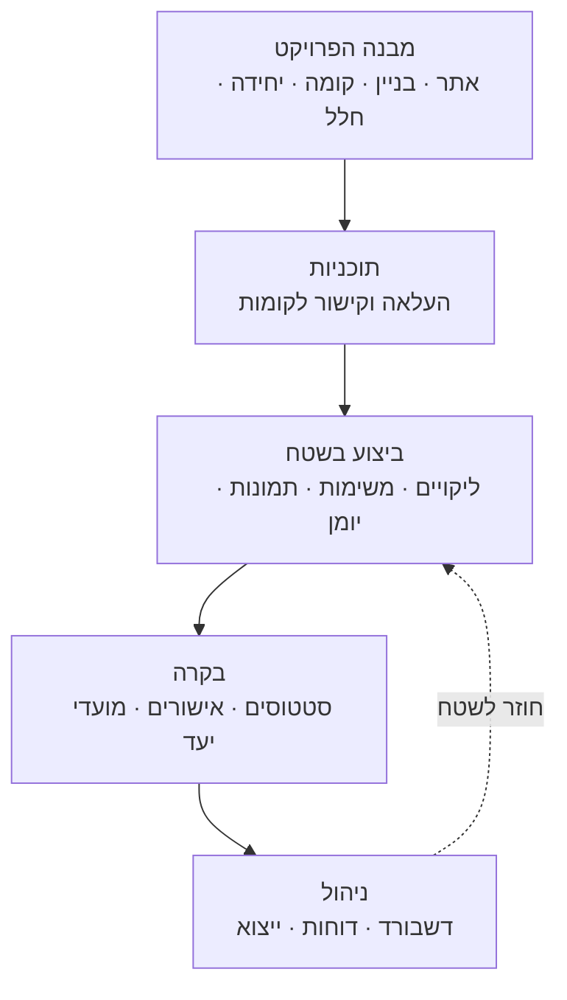
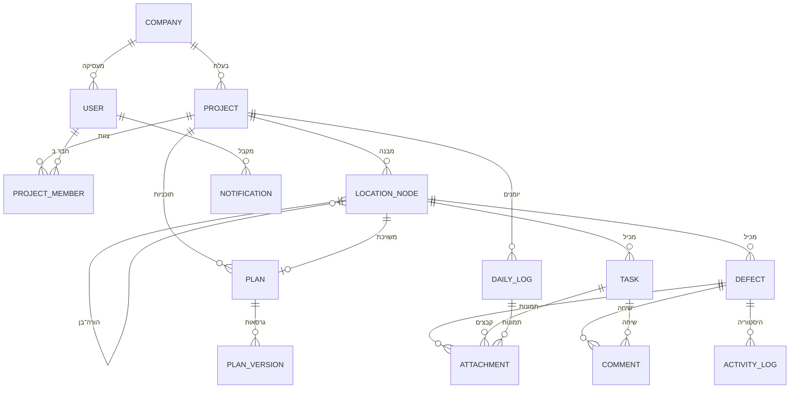
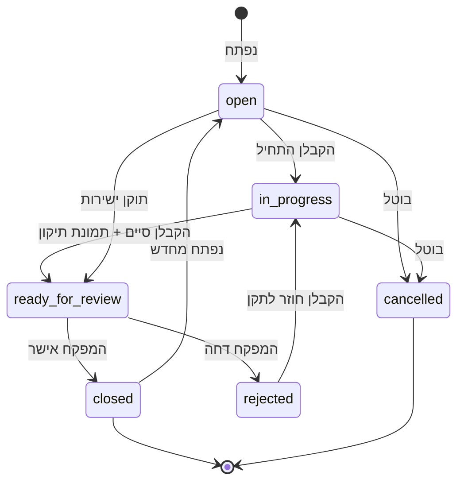
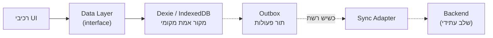
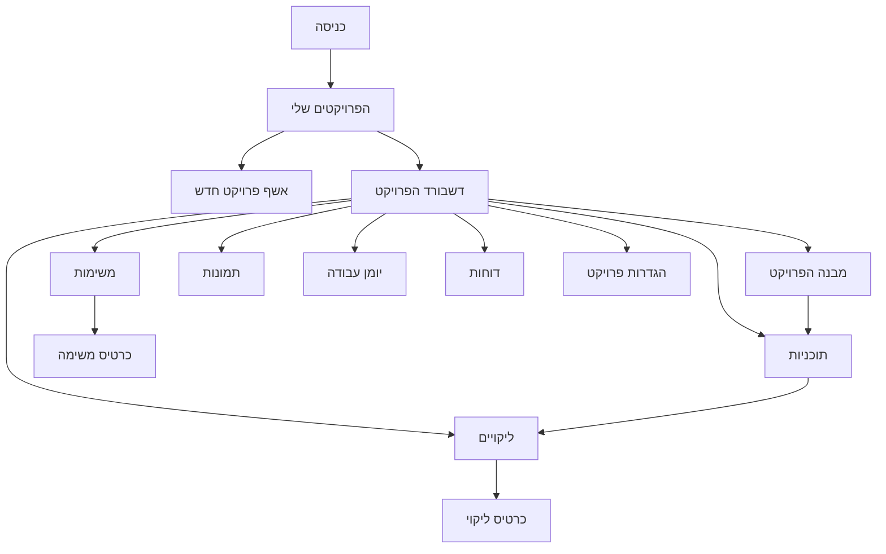

# BuildFlow — מסמך אפיון מלא

**גרסה:** 1.0 (טיוטה לאישור)
**תאריך:** 2026-08-07
**סוג:** כלי פנימי / פרויקט אישי — מערכת לניהול פרויקטי בנייה והנדסה
**סטטוס:** ממתין לאישור לפני תחילת פיתוח

---

## תוכן עניינים

1. [סקירה כללית](#1-סקירה-כללית)
2. [מטרות ולא-מטרות](#2-מטרות-ולא-מטרות)
3. [עקרונות מנחים](#3-עקרונות-מנחים)
4. [משתמשים, תפקידים והרשאות](#4-משתמשים-תפקידים-והרשאות)
5. [מודל הנתונים](#5-מודל-הנתונים)
6. [עץ המיקומים](#6-עץ-המיקומים)
7. [תוכניות וסיכות](#7-תוכניות-וסיכות)
8. [ארכיטקטורת Offline וסנכרון](#8-ארכיטקטורת-offline-וסנכרון)
9. [ניהול תמונות](#9-ניהול-תמונות)
10. [המסכים](#10-המסכים)
11. [התראות](#11-התראות)
12. [דוחות וייצוא](#12-דוחות-וייצוא)
13. [סטאק טכנולוגי ומבנה הפרויקט](#13-סטאק-טכנולוגי-ומבנה-הפרויקט)
14. [שפה, RTL ונגישות](#14-שפה-rtl-ונגישות)
15. [עיצוב](#15-עיצוב)
16. [תוכנית עבודה בשלבים](#16-תוכנית-עבודה-בשלבים)
17. [מחוץ להיקף](#17-מחוץ-להיקף)
18. [סיכונים](#18-סיכונים)
19. [נספח: מילון מונחים](#19-נספח-מילון-מונחים)

---

## 1. סקירה כללית

**BuildFlow** היא מערכת לניהול פרויקטי בנייה והנדסה, המיועדת לחבר בין העבודה בשטח לבין הניהול במשרד.

הרעיון המרכזי: **כל פריט במערכת חי במקום פיזי**. ליקוי לא "קיים בפרויקט" — הוא קיים *בדירה 4, קומה 3, בניין A, בנקודה מסוימת על התוכנית*. מהמיקום הזה נגזרים ההקשר, החיפוש, הדוחות והתמונה הניהולית.

### מה המערכת עושה



### תרחיש שימוש מרכזי (Golden Path)

1. מנהל הפרויקט יוצר פרויקט ובונה את המבנה הפיזי מתבנית.
2. הוא מעלה תוכניות קומה ומשייך לכל קומה תוכנית.
3. הוא מזמין מפקח וקבלני משנה.
4. המפקח מסתובב באתר עם הטלפון — **ללא קליטה**.
5. הוא רואה ליקוי, פותח פריט חדש, נועץ סיכה על התוכנית, מצלם, מסמן על התמונה, בוחר קבלן אחראי ומועד יעד.
6. הפריט נשמר מקומית מיידית.
7. כשחוזרת קליטה — הכול מסונכרן, והקבלן מקבל התראה.
8. הקבלן מתקן, מצלם תמונת תיקון, ומעביר ל"ממתין לבדיקה".
9. המפקח מאמת בשטח וסוגר.
10. מנהל הפרויקט רואה בדשבורד ירידה בליקויים הפתוחים, ומפיק דוח PDF ליזם.

---

## 2. מטרות ולא-מטרות

### מטרות

| # | מטרה | מדד הצלחה |
|---|------|-----------|
| M1 | פתיחת ליקוי מלאה בשטח בפחות מ-45 שניות | מדידה ידנית על מכשיר אמיתי |
| M2 | עבודה מלאה ללא קליטה | כל פעולה נשמרת ומסונכרנת לאחר חזרת רשת |
| M3 | הקשר מרחבי לכל פריט | 100% מהליקויים משויכים למיקום; ≥80% גם לנקודה על תוכנית |
| M4 | תמונת מצב ניהולית במבט אחד | דשבורד שכל מדד בו לחיץ ומוביל לרשימה |
| M5 | ממשק עברית RTL מלא ונוח בנייד | שימוש בנייד ללא זום ידני |

### לא-מטרות (בגרסה זו)

- אינו מוצר SaaS מסחרי — אין חיוב, אין onboarding עצמי, אין multi-tenancy מלא.
- אינו מחליף תוכנת לוחות זמנים (MS Project / Primavera).
- אינו מערכת BIM ואינו מציג מודלים תלת-ממדיים.
- אינו מנהל כספים, חוזים או חשבונות קבלנים.
- אינו נדרש לעמוד בתקני אבטחה ארגוניים (SOC2 וכד').

---

## 3. עקרונות מנחים

1. **Local-first.** ה-DB המקומי הוא מקור האמת בזמן העבודה. הרשת היא שיפור, לא תנאי.
2. **המיקום הוא ציר המערכת.** כל ישות נושאת `location_id`.
3. **מעט שדות חובה.** בשטח ממלאים מינימום. שאר השדות אופציונליים ונוספים אחר כך.
4. **פעולה אחת = מסך אחד.** בלי אשפים ארוכים בנייד.
5. **גנרי במודל, קונקרטי בממשק.** עץ מיקומים גנרי לגמרי — אבל המשתמש רואה "בניין / קומה / דירה".
6. **הכול ניתן למעקב.** לכל פריט היסטוריית שינויים.
7. **בלי מחיקה קשה.** מחיקה = `archived_at`. שום דבר לא נעלם.
8. **UUID בצד לקוח.** כל ID נוצר במכשיר. תנאי הכרחי ל-offline.

---

## 4. משתמשים, תפקידים והרשאות

### 4.1 התפקידים

בגרסה זו — **4 תפקידים קבועים**, לא מטריצה גנרית. גנריות תתווסף רק אם תידרש.

| תפקיד | קוד | מי זה | היקף |
|-------|-----|-------|------|
| מנהל מערכת | `admin` | בעל המערכת | כל החברה, כל הפרויקטים |
| מנהל פרויקט | `pm` | מנהל הפרויקט | הפרויקטים שהוא משויך אליהם |
| מפקח / מנהל עבודה | `supervisor` | עובד שטח מטעם המזמין | הפרויקטים שהוא משויך אליהם |
| קבלן משנה | `contractor` | נציג קבלן חיצוני | **רק פריטים שהוקצו לחברה שלו** |

> **הערה:** "יזם / בעלים" בגרסה זו מיוצג ע"י `pm` בלבד-קריאה. תפקיד `viewer` ייתכן בשלב הבא.

### 4.2 מטריצת הרשאות

| פעולה | admin | pm | supervisor | contractor |
|-------|:-----:|:--:|:----------:|:----------:|
| יצירת פרויקט | ✅ | ✅ | ❌ | ❌ |
| עריכת הגדרות פרויקט | ✅ | ✅ | ❌ | ❌ |
| עריכת עץ המיקומים | ✅ | ✅ | ❌ | ❌ |
| העלאת תוכנית | ✅ | ✅ | ✅ | ❌ |
| הזמנת משתמשים | ✅ | ✅ | ❌ | ❌ |
| צפייה בכל הליקויים בפרויקט | ✅ | ✅ | ✅ | ❌ (רק שלו) |
| יצירת ליקוי | ✅ | ✅ | ✅ | ❌ |
| הקצאת ליקוי לקבלן | ✅ | ✅ | ✅ | ❌ |
| שינוי סטטוס ל"ממתין לבדיקה" | ✅ | ✅ | ✅ | ✅ |
| **סגירת ליקוי** | ✅ | ✅ | ✅ | ❌ |
| פתיחה מחדש של ליקוי | ✅ | ✅ | ✅ | ❌ |
| הוספת תגובה / תמונה לפריט | ✅ | ✅ | ✅ | ✅ (שלו) |
| יצירת משימה | ✅ | ✅ | ✅ | ❌ |
| מילוי יומן עבודה | ✅ | ✅ | ✅ | ❌ |
| **נעילת יומן עבודה** | ✅ | ✅ | ❌ | ❌ |
| צפייה בדשבורד הפרויקט | ✅ | ✅ | ✅ | ❌ (דשבורד מצומצם) |
| ייצוא דוחות | ✅ | ✅ | ✅ | ❌ |
| ארכוב פרויקט | ✅ | ✅ | ❌ | ❌ |
| ניהול משתמשים בחברה | ✅ | ❌ | ❌ | ❌ |

**כלל הזהב לקבלן משנה:** רואה **רק** פריטים שבהם `assigned_company_id == החברה שלו`. לא רואה ליקויים של קבלנים אחרים, לא רואה את היומן, לא רואה את הדשבורד המלא.

### 4.3 מימוש

```ts
// שכבה אחת, נקודה אחת של אמת
can(user, 'defect:close', defect) → boolean
```
הבדיקה מתבצעת גם ב-UI (הסתרת כפתורים) וגם בשכבת הנתונים (חסימת פעולה). כשיתווסף שרת — אותה מטריצה תתורגם ל-RLS.

---

## 5. מודל הנתונים

### 5.1 תרשים ישויות



### 5.2 שדות משותפים לכל ישות

כל טבלה כוללת:

| שדה | טיפוס | הערה |
|-----|-------|------|
| `id` | `uuid` | נוצר בצד לקוח |
| `created_at` | `iso string` | |
| `created_by` | `uuid` → user | |
| `updated_at` | `iso string` | |
| `updated_by` | `uuid` → user | |
| `archived_at` | `iso string \| null` | מחיקה רכה |
| `_dirty` | `boolean` | ממתין לסנכרון |
| `_version` | `number` | לזיהוי קונפליקטים |

### 5.3 טבלאות

#### `company`
`id` · `name` · `logo_url` · `type` (`owner` \| `contractor` \| `consultant`) · `contact_email` · `contact_phone`

#### `user`
`id` · `full_name` · `email` · `phone` · `avatar_url` · `company_id` · `role` (`admin`\|`pm`\|`supervisor`\|`contractor`) · `language` (`he`\|`en`\|`ar`\|`ru`) · `is_active`

#### `project`
`id` · `company_id` · `name` · `code` · `type` (`residential`\|`office`\|`infrastructure`\|`industrial`\|`other`) · `address` · `city` · `lat` · `lng` · `start_date` · `end_date` · `status` (`planning`\|`active`\|`on_hold`\|`completed`) · `pm_user_id` · `cover_image_url` · `progress_pct`

#### `project_member`
`id` · `project_id` · `user_id` · `role_override` · `joined_at`

#### `location_node`
ראה [סעיף 6](#6-עץ-המיקומים).
`id` · `project_id` · `parent_id` · `type` · `name` · `code` · `sort_order` · `path` · `depth` · `plan_id` · `metadata` (JSON)

#### `plan`
`id` · `project_id` · `name` · `discipline` (`architecture`\|`structure`\|`mep`\|`other`) · `sheet_number` · `current_version_id`

#### `plan_version`
`id` · `plan_id` · `version_number` · `file_url` · `file_type` (`pdf`\|`png`\|`jpg`) · `page_number` · `width_px` · `height_px` · `uploaded_at` · `uploaded_by` · `notes` · `is_current`

#### `defect`
| שדה | טיפוס | חובה | הערה |
|-----|-------|:----:|------|
| `id` | uuid | ✅ | |
| `project_id` | uuid | ✅ | |
| `number` | int | ✅ | רץ פר-פרויקט |
| `title` | string | ✅ | |
| `description` | text | | |
| `location_id` | uuid | ✅ | |
| `pin_x`, `pin_y` | float 0–1 | | יחסי לתוכנית |
| `plan_version_id` | uuid | | התוכנית שעליה נעוצה הסיכה |
| `type` | enum | | ראה 5.4 |
| `severity` | enum | ✅ | `low`\|`medium`\|`high`\|`critical` |
| `status` | enum | ✅ | ראה 5.5 |
| `assigned_company_id` | uuid | | הקבלן האחראי |
| `assigned_user_id` | uuid | | |
| `due_date` | date | | |
| `closed_at` | datetime | | |
| `closed_by` | uuid | | |
| `reopen_count` | int | | |

#### `task`
`id` · `project_id` · `number` · `title` · `description` · `location_id` · `status` (`new`\|`in_progress`\|`blocked`\|`review`\|`done`) · `priority` (`low`\|`normal`\|`high`) · `assigned_company_id` · `assigned_user_id` · `due_date` · `progress_pct` · `blocked_reason`

#### `attachment`
`id` · `project_id` · `entity_type` (`defect`\|`task`\|`daily_log`\|`comment`) · `entity_id` · `kind` (`photo`\|`document`) · `file_url` · `thumb_url` · `file_name` · `file_size` · `mime_type` · `width` · `height` · `taken_at` · `location_id` · `caption` · `annotations` (JSON — סימונים על התמונה) · `phase` (`before`\|`after`\|`general`)

#### `comment`
`id` · `entity_type` · `entity_id` · `body` · `author_id` · `mentions` (uuid[])

#### `activity_log`
`id` · `entity_type` · `entity_id` · `action` (`created`\|`status_changed`\|`assigned`\|`commented`\|`attachment_added`\|`due_changed`\|`closed`\|`reopened`) · `field` · `old_value` · `new_value` · `actor_id` · `at`

#### `daily_log`
`id` · `project_id` · `date` · `weather` (`clear`\|`cloudy`\|`rain`\|`heat`\|`wind`) · `temp_c` · `work_hours_from` · `work_hours_to` · `manpower` (JSON: `[{company_id, trade, count}]`) · `equipment` (JSON) · `work_performed` (text) · `deliveries` (text) · `safety_events` (text) · `delays` (text) · `visitors` (text) · `notes` · `status` (`draft`\|`submitted`\|`locked`) · `locked_at` · `locked_by`

#### `notification`
`id` · `user_id` · `type` · `title` · `body` · `entity_type` · `entity_id` · `project_id` · `read_at` · `created_at`

### 5.4 סוגי ליקוי (ניתן להרחבה בהגדרות)

`בטון` · `טיח` · `ריצוף` · `איטום` · `חשמל` · `אינסטלציה` · `מיזוג` · `אלומיניום` · `נגרות` · `צבע` · `גבס` · `בטיחות` · `ניקיון` · `אחר`

### 5.5 מכונת מצבים — ליקוי



| סטטוס | תווית | צבע | מי יכול להגיע לכאן |
|-------|-------|-----|--------------------|
| `open` | פתוח | אדום | יוצר / מפקח |
| `in_progress` | בטיפול | כתום | קבלן |
| `ready_for_review` | ממתין לבדיקה | כחול | קבלן |
| `rejected` | נדחה | סגול | מפקח |
| `closed` | סגור | ירוק | מפקח / PM |
| `cancelled` | בוטל | אפור | PM |

**חריגה נגזרת:** ליקוי הוא `overdue` אם `due_date < today` והסטטוס אינו `closed`/`cancelled`. לא נשמר בשדה — מחושב.

---

## 6. עץ המיקומים

### 6.1 למה גנרי

היררכיה קשיחה `בניין→קומה→דירה→חלל` שוברת פרויקטי תשתית, גשרים, מתקנים תעשייתיים ומגדלי משרדים. הפתרון: **טבלה אחת רקורסיבית**.

```
location_node
  id, project_id, parent_id, type, name, code,
  sort_order, path, depth, plan_id, metadata
```

`type` הוא מחרוזת מתוך רשימה ניתנת להרחבה:
`site` · `building` · `wing` · `floor` · `unit` · `space` · `zone` · `section` · `system` · `segment` · `custom`

`path` הוא **materialized path** (`/uuid1/uuid2/uuid3`) — מאפשר שאילתת "כל הצאצאים" בשורה אחת, גם ב-IndexedDB.

### 6.2 תבניות מבנה

באשף יצירת הפרויקט בוחרים תבנית:

| תבנית | היררכיה שנוצרת |
|-------|----------------|
| **מגורים** | אתר → בניין → קומה → דירה → חלל |
| **משרדים** | אתר → בניין → קומה → אגף → חלל |
| **תשתית** | פרויקט → קטע → מקטע → אלמנט |
| **תעשייה** | אתר → מבנה → אזור → מערכת |
| **ריק** | בונים ידנית |

### 6.3 אשף בניית המבנה

1. שם האתר.
2. הוספת בניין: שם, מספר קומות, קומות מרתף, קומת קרקע.
3. **קומה טיפוסית** — הגדרת דירות וחללים פעם אחת.
4. **שכפול** הקומה הטיפוסית לטווח קומות (למשל 2–14).
5. התאמה ידנית לקומות חריגות (קרקע, גג, מרתף).
6. הגדרת סוגי חללים (סלון, חדר, מטבח, אמבטיה, מרפסת, מסדרון, חדר מדרגות, חדר מכונות).
7. שיוך תוכנית לכל קומה.
8. תצוגה מקדימה + אישור.

### 6.4 פעולות על העץ

- הוספה / עריכה / שכפול / העברה (drag) / ארכוב
- שינוי סדר (`sort_order`)
- חיפוש בעץ
- **badge** על כל צומת: מספר פריטים פתוחים בו ובכל צאצאיו
- צביעה: אדום = יש חריגה, כתום = יש פתוחים, ירוק = נקי, אפור = אין פריטים

### 6.5 UI

- **דסקטופ:** עץ צדדי מתקפל + פאנל תוכן
- **נייד:** ניווט דרילדאון (רשימה → לחיצה → רשימה) עם breadcrumb לחזרה

---

## 7. תוכניות וסיכות

הרכיב הכבד והמבדל ביותר במערכת.

### 7.1 העלאה ועיבוד

1. המשתמש מעלה PDF / PNG / JPG.
2. PDF: `pdf.js` מרנדר את העמוד הנבחר ל-canvas.
3. נשמר raster בשתי רזולוציות: `full` (עד 4000px רוחב) ו-`thumb` (400px).
4. נשמרים `width_px`, `height_px`.
5. התוכנית משויכת ל-`location_node` (בדרך כלל קומה).
6. PDF רב-עמודי: המשתמש בוחר עמוד; כל עמוד = `plan_version` נפרד.

### 7.2 הצגה

- Canvas עם **pan + zoom** (pinch בנייד, גלגלת בדסקטופ)
- מגבלת זום: 0.5×–8×
- כפתורי איפוס והתאמה למסך
- טעינה מדורגת: thumb ראשון, אז full

### 7.3 סיכות

- קואורדינטות **יחסיות** `(x, y)` בטווח 0–1 — כך שינוי רזולוציה או מסך אינו משנה מיקום.
- הסיכה מוצגת בגודל קבוע במסך (לא מתרחבת בזום).
- צבע הסיכה = צבע הסטטוס. מספר הליקוי בתוכה.
- לחיצה על סיכה → כרטיס תצוגה מהירה (תמונה, כותרת, סטטוס, אחראי) → לחיצה שנייה נכנסת לפריט.
- סיכות חופפות מקובצות ל-cluster עם מונה; זום מפרק אותן.
- **מצב נעיצה:** לחיצה ארוכה / כפתור "+" → crosshair → אישור.
- סינון סיכות לפי סטטוס / סוג / אחראי / חריגה.

### 7.4 גרסאות תוכנית

כשמעלים גרסה חדשה:
- הגרסה הישנה נשמרת ומסומנת `is_current = false`.
- **הסיכות לא זזות** — הן שומרות `plan_version_id` ואת הקואורדינטות שלהן.
- בגרסה החדשה מוצגת התראה: "N סיכות מגרסה קודמת". המשתמש יכול:
  - להעביר את כולן כמו שהן (אותן קואורדינטות),
  - להעביר סיכה-סיכה ידנית,
  - להשאיר אותן על הגרסה הישנה.
- מיפוי אוטומטי בין גרסאות **לא** ייבנה בגרסה זו.

### 7.5א עיגון קואורדינטות (Georeferencing)

קישור התוכנית לרשת קואורדינטות אמיתית (רשת ישראל / ITM או רשת מקומית):

- **כיול בשתי נקודות:** מסמנים שתי נקודות מוכרות על התוכנית ומזינים את הנ.צ. שלהן (E/N במטרים). מזה נגזר טרנספורם דמיון מלא — קנה מידה, סיבוב והזזה. הנקודות צריכות להיות מרוחקות זו מזו ככל האפשר לדיוק מרבי.
- העיגון נשמר על גרסת התוכנית (`plan_version.georef`) ומסתנכרן בין מכשירים.
- **קריאה חיה:** תנועת הסמן על תוכנית מכוילת מציגה E/N שוטף.
- **נ.צ. לכל סיכה:** כרטיס הסיכה מציג את הקואורדינטה האמיתית של הליקוי.
- **עבור לנ.צ.:** הקלדת קואורדינטה ממקמת סמן על התוכנית וממרכזת אליו — כולל "נעץ ליקוי כאן".
- **"המיקום שלי" (GPS):** בתוכנית מכוילת לרשת ישראל, כפתור אחד מציג את מיקום המשתמש כנקודה כחולה חיה עם עיגול דיוק בקנה מידה אמיתי. ההמרה WGS84→ITM (הסטת דאטום מולודנסקי + היטל טרנסוורס-מרקטור EPSG:2039) ממומשת ב-`lib/itm.ts`; דיוקה ~מטר, מתחת לדיוק GPS אזרחי. מחוץ לגבולות התוכנית מוצג המרחק ממנה.
- מחוץ להיקף בשלב זה: מדידת מרחקים, ייבוא קובצי world-file, ניווט אל ליקוי.

### 7.5 סימון על תמונות

בנוסף לסיכות על תוכנית, ניתן לסמן **על גבי תמונה**:
- חץ, עיגול, מלבן, טקסט חופשי, חופשי (freehand)
- 3 צבעים: אדום, צהוב, ירוק
- נשמר כ-JSON וקטורי בשדה `annotations` — **התמונה המקורית לעולם לא משתנה**
- ניתן לערוך או להסיר סימון

---

## 8. ארכיטקטורת Offline וסנכרון

### 8.1 העיקרון



**כל** קריאה וכתיבה עוברת דרך `DataLayer`. הרכיבים לא יודעים אם יש שרת. זו הנקודה שמאפשרת להוסיף backend מאוחר יותר בלי לגעת ב-UI.

### 8.2 חוזה שכבת הנתונים

```ts
interface DataLayer {
  // קריאה — תמיד מקומי, תמיד מיידי
  list<T>(table: Table, filter?: Filter): Promise<T[]>
  get<T>(table: Table, id: string): Promise<T | null>
  watch<T>(table: Table, filter?: Filter): Observable<T[]>  // live query

  // כתיבה — מקומי מיידי + הוספה ל-outbox
  create<T>(table: Table, data: Partial<T>): Promise<T>
  update<T>(table: Table, id: string, patch: Partial<T>): Promise<T>
  archive(table: Table, id: string): Promise<void>

  // קבצים
  putBlob(id: string, blob: Blob): Promise<string>   // מחזיר URL מקומי
  getBlob(id: string): Promise<Blob | null>

  // סנכרון
  syncStatus(): Observable<SyncState>
  syncNow(): Promise<SyncResult>
}
```

### 8.3 ה-Outbox

כל כתיבה נרשמת בטבלת `outbox`:

`id` · `op` (`create`\|`update`\|`archive`) · `table` · `entity_id` · `payload` · `created_at` · `attempts` · `last_error` · `status` (`pending`\|`syncing`\|`failed`\|`done`)

- עיבוד **לפי סדר** (FIFO) כדי לשמור על עקביות סיבתית.
- Exponential backoff על כישלון: 2s, 4s, 8s, 16s, 30s.
- אחרי 5 כישלונות → `failed`, ומוצג ב-UI עם אפשרות ניסיון חוזר ידני.

### 8.4 מדיניות קונפליקטים

| מצב | פתרון |
|-----|-------|
| שני משתמשים עדכנו **שדות שונים** | מיזוג ברמת שדה |
| שני משתמשים עדכנו **אותו שדה** | Last-Write-Wins לפי `updated_at`, והמפסיד נרשם ב-`activity_log` |
| שינוי סטטוס מתנגש | מכונת המצבים גוברת — מעבר לא חוקי נדחה ומוצגת הודעה |
| תגובות ותמונות | **תמיד מתמזגות** (append-only) — לעולם לא נאבדות |
| ישות נמחקה בצד אחד ועודכנה בשני | העדכון גובר, המחיקה מבוטלת |

### 8.5 חיווי למשתמש

סרגל סטטוס קבוע:
- 🟢 **מסונכרן** — הכול למעלה
- 🔵 **מסנכרן…** — N פריטים בתור
- 🟡 **לא מקוון** — N שינויים ממתינים
- 🔴 **שגיאת סנכרון** — לחיצה פותחת פירוט וניסיון חוזר

**עיקרון:** המשתמש אף פעם לא חסום. אין ספינר שמונע פעולה.

---

## 9. ניהול תמונות

תמונות הן הנפח, העלות והכאב הגדולים ביותר.

### 9.1 צנרת העלאה

1. צילום / בחירה מהגלריה.
2. **דחיסה בצד לקוח** לפני שמירה: מקסימום 1920px בצד הארוך, JPEG איכות 0.8. יעד: <400KB לתמונה.
3. יצירת thumbnail 300px.
4. שמירת שני ה-blobs ב-IndexedDB.
5. שמירת רשומת `attachment` עם URL מקומי.
6. הוספה ל-outbox להעלאה כשתהיה רשת.

### 9.2 מטא-דאטה נשמרת

- `taken_at` (מה-EXIF אם קיים, אחרת זמן ההוספה)
- `location_id` — נגזר מהפריט
- `created_by`
- GPS — **לא** נשמר בגרסה זו (פרטיות; ניתן להפעיל בהגדרות בעתיד)

### 9.3 גלריה

- Grid רספונסיבי עם lazy-load
- סינון: תאריך · מיקום · מצלם · פריט מקושר · שלב (לפני/אחרי)
- תצוגת lightbox עם החלקה
- **השוואת לפני/אחרי** — שתי תמונות זו לצד זו, או סליידר
- ייצוא נבחרות ל-PDF

### 9.4 ניהול מכסה

- מעקב אחרי נפח IndexedDB
- אזהרה ב-80% מהמכסה
- ניקוי אוטומטי של blobs שכבר סונכרנו (אם יש backend) — נשמר רק thumb

---

## 10. המסכים

### 10.1 מפת ניווט



**ניווט תחתון בנייד (5 פריטים):** דשבורד · תוכנית · ליקויים · משימות · עוד
**ניווט צדדי בדסקטופ:** רשימה מלאה + מתג פרויקט למעלה

---

### 10.2 מסך כניסה

**שדות:** דוא"ל / טלפון · סיסמה · "זכור אותי"
**קישורים:** שכחתי סיסמה · בחירת שפה
**לאחר כניסה:** אם יש פרויקט אחרון פעיל → ישירות אליו. אחרת → "הפרויקטים שלי".

בגרסה המקומית: משתמשי דמו מוכנים לבחירה מהירה + PIN אופציונלי.

---

### 10.3 "הפרויקטים שלי"

**כותרת:** לוגו החברה · שם · שורת סיכום (X פעילים · Y הושלמו · Z ליקויים פתוחים)

**כרטיס פרויקט:**
- תמונת נושא
- שם + קוד
- Badge סטטוס
- פס התקדמות + אחוז
- מנהל הפרויקט (אווטאר)
- תאריכי התחלה–סיום
- 🔴 ליקויים פתוחים · ⚠️ באיחור
- תאריך פעילות אחרונה

**פעולות:** יצירת פרויקט · חיפוש · סינון (סטטוס, סוג, מנהל) · מיון · מעבר לתצוגת טבלה · ארכוב

---

### 10.4 אשף פרויקט חדש

5 שלבים, ניתן לדלג ולחזור:

| שלב | תוכן |
|-----|------|
| 1. פרטים | שם · קוד · סוג · תמונת נושא |
| 2. מיקום וזמנים | כתובת · עיר · תאריך התחלה · תאריך סיום יעד |
| 3. צוות | מנהל פרויקט · הזמנת משתמשים (דוא"ל + תפקיד) · הוספת חברות קבלניות |
| 4. מבנה | בחירת תבנית → אשף בניית מבנה (סעיף 6.3) |
| 5. סיכום | תצוגה מקדימה · "צור פרויקט" |

תוכניות ומסמכים מועלים אחרי היצירה, לא באשף.

---

### 10.5 דשבורד הפרויקט

**שורת KPI (כל אחד לחיץ):**

| מדד | הצגה |
|-----|------|
| התקדמות כללית | טבעת % |
| ליקויים פתוחים | מספר גדול + מגמה שבועית |
| ליקויים באיחור | מספר + אדום אם >0 |
| ממתינים לבדיקה | מספר |
| משימות פתוחות | מספר |
| ימים לסיום היעד | מספר + אזהרה אם חורג |

**כרטיסים:**
- **ליקויים לפי סטטוס** — טור מוערם
- **ליקויים לפי קבלן** — עמודות מדורגות
- **ליקויים לפי בניין/קומה** — heatmap
- **מגמת פתיחה מול סגירה** — קו לאורך 8 שבועות
- **5 החריגות הדחופות ביותר** — רשימה
- **פעילות אחרונה** — feed
- **תמונות אחרונות** — 6 תמונות
- **יומן היום** — מולא / לא מולא

**כלל:** כל מספר במסך פותח את הרשימה המסוננת שמאחוריו.

**דשבורד קבלן משנה:** רק המשימות והליקויים שלו, מועדים קרובים, ומה נדחה.

---

### 10.6 מסך מבנה הפרויקט

- עץ ניווט עם badges וצביעה
- פאנל צומת נבחר: פרטים · תוכנית משויכת · פריטים פתוחים · פעולות
- כפתורים: הוסף בן · שכפל · העבר · ארכב · שייך תוכנית
- חיפוש בעץ
- מצב עריכה נפרד ממצב צפייה (למניעת שינויים בשוגג)

---

### 10.7 מסך תוכניות

- רשימת תוכניות: שם · מספר גיליון · דיסציפלינה · גרסה · קומה משויכת · תאריך
- העלאה: קובץ → בחירת עמוד → שם ומספר → שיוך למיקום
- כניסה לתוכנית → **צופה התוכנית** (סעיף 7)
- ניהול גרסאות: היסטוריה · השוואת גרסאות זו לצד זו · שחזור

---

### 10.8 מסך ליקויים

#### רשימה

תצוגות: **רשימה** · **לוח (Kanban לפי סטטוס)** · **על גבי תוכנית** · **מפה** (עץ מיקומים)

שורה ברשימה: תמונה ממוזערת · `#מספר` · כותרת · מיקום · badge חומרה · badge סטטוס · אווטאר אחראי · תאריך יעד (אדום אם חרג) · 💬 מונה תגובות

**סינון:** מיקום (עץ) · סטטוס · חומרה · סוג · קבלן · אחראי · טווח תאריכים · חריגים בלבד · "שיצרתי" · "באחריותי"
**מיון:** מספר · תאריך · יעד · חומרה · מיקום
**פעולות מרובות:** הקצאה, שינוי מועד, ייצוא

#### יצירת ליקוי — הזרימה בנייד

מסך אחד, גלילה אחת. שדות חובה מסומנים:

1. **📷 צלם** — כפתור ענק, ראשון. (אפשר גם לדלג)
2. **סמן על התמונה** (אופציונלי)
3. **כותרת** ✅
4. **מיקום** ✅ — נבחר מראש אם נכנסנו מהקשר של מיקום
5. **נעץ על התוכנית** — פותח את התוכנית של הקומה
6. **חומרה** ✅ — 4 כפתורים
7. **סוג** — רשימה
8. **קבלן אחראי**
9. **מועד יעד** — קיצורים: היום · מחר · שבוע · תאריך
10. **תיאור** — טקסט חופשי
11. **שמור**

**יעד: מתחת ל-45 שניות.** שדות 7–10 מקופלים תחת "פרטים נוספים".

#### כרטיס ליקוי

- כותרת + מספר + badges
- גלריית תמונות (לפני / אחרי)
- מיקום + סיכה קטנה על התוכנית (לחיצה מגדילה)
- פרטים: סוג, חומרה, אחראי, יעד, יוצר, תאריכים
- **פס סטטוס** עם כפתורי פעולה מותרים לפי תפקיד
- **שיחה** — תגובות עם תמונות ותיוגי משתמשים
- **היסטוריה** — כל שינוי, מי ומתי
- פעולות: שכפל · העבר · ייצא PDF · שתף קישור

---

### 10.9 מסך משימות

זהה במבנה לליקויים, בהבדלים:
- אין חומרה, יש **עדיפות**
- יש **אחוז התקדמות**
- יש **סיבת חסימה** במצב `blocked`
- תצוגת ברירת מחדל: **לוח Kanban**
- ניתן להמיר משימה לליקוי ולהיפך

---

### 10.10 מסך תמונות

- Grid + סינונים (סעיף 9.3)
- קיבוץ לפי: תאריך · מיקום · פריט
- Lightbox עם החלקה, זום, מטא-דאטה
- מצב **השוואה** — בחירת 2 תמונות
- בחירה מרובה → ייצוא PDF / הורדה

---

### 10.11 מסך יומן עבודה

**רשימה:** לוח שנה חודשי — ירוק = נעול, צהוב = טיוטה, אפור = לא מולא.

**טופס יומן (מקוצר, מהיר למילוי):**

| קטגוריה | שדות |
|---------|------|
| כללי | תאריך · מזג אוויר (אייקונים) · טמפרטורה · שעות עבודה |
| כוח אדם | טבלה: קבלן · מקצוע · כמות. כפתור "+" |
| ציוד | רשימת צ'קבוקסים ניתנת להגדרה |
| עבודות שבוצעו | טקסט + אפשרות לצרף פעילויות מהמערכת |
| משלוחים | טקסט קצר |
| בטיחות | טקסט + מתג "אירוע בטיחות" (מדגיש את היומן) |
| עיכובים | טקסט + סיבה מרשימה |
| מבקרים | טקסט |
| תמונות | העלאה מרובה |
| הערות | טקסט חופשי |

**זרימה:** טיוטה → שליחה → נעילה (PM). יומן נעול אינו ניתן לעריכה, רק להוספת נספח.
**ייצוא:** PDF ליום בודד או לטווח תאריכים.

---

### 10.12 מסך משתמשים וקבלנים

**משתמשים:** שם · דוא"ל · חברה · תפקיד · פרויקטים · פעיל · פעילות אחרונה
**פעולות:** הזמנה · שינוי תפקיד · שיוך לפרויקטים · השבתה

**חברות:** שם · סוג · איש קשר · טלפון · מספר פריטים פתוחים · אחוז סגירה בזמן

---

### 10.13 מרכז התראות

- טאבים: הכול · לא נקראו
- קיבוץ לפי יום
- לחיצה → הפריט
- "סמן הכול כנקרא"
- הגדרות: אילו סוגי התראות לקבל

---

### 10.14 הגדרות

**משתמש:** פרטים · שפה · סיסמה · העדפות התראות · ערכת נושא (בהיר/כהה)
**חברה:** שם · לוגו · משתמשים · חברות חיצוניות · סוגי ליקויים · סוגי חללים · ציוד
**פרויקט:** פרטים · צוות והרשאות · מבנה · תוכניות · סוגי ליקויים פעילים · התראות · ארכוב

---

## 11. התראות

### 11.1 אירועי טריגר

| אירוע | מקבל |
|-------|------|
| הוקצה לך ליקוי / משימה | האחראי |
| התקבלה תגובה בפריט שלך | יוצר + אחראי + משתתפי השיחה |
| תויגת בתגובה | המתויג |
| הפריט שלך הועבר ל"ממתין לבדיקה" | היוצר / המפקח |
| הליקוי שלך נדחה | הקבלן |
| הליקוי שלך נסגר | הקבלן + היוצר |
| מועד יעד מחר | האחראי |
| הפריט עבר את מועדו | האחראי + מנהל הפרויקט |
| הוזמנת לפרויקט | המוזמן |
| הועלתה גרסת תוכנית חדשה | צוות הפרויקט |
| נרשם אירוע בטיחות ביומן | מנהל הפרויקט |

### 11.2 ערוצים

| ערוץ | סטטוס בגרסה זו |
|------|----------------|
| In-app (מרכז התראות + badge) | ✅ נבנה |
| Toast בזמן אמת | ✅ נבנה |
| Push (Web Push) | תשתית מוכנה, מופעל עם ה-backend |
| דוא"ל | שלב הבא |
| סיכום יומי / שבועי | שלב הבא |

### 11.3 כללי איפוק

- קיבוץ: 5 תגובות באותו פריט תוך שעה = התראה אחת.
- לא שולחים התראה על פעולה שהמשתמש עצמו ביצע.
- שעות שקט ניתנות להגדרה.

---

## 12. דוחות וייצוא

| דוח | תוכן |
|-----|------|
| **דוח ליקויים** | לפי סינון נוכחי · טבלה + תמונות · קיבוץ לפי מיקום או קבלן |
| **דוח ליקוי בודד** | דף אחד: תמונות לפני/אחרי, פרטים, היסטוריה, שיחה |
| **דוח יומן עבודה** | יום בודד או טווח |
| **דוח התקדמות** | KPI, גרפים, חריגות — לדשבורד ההנהלה |
| **דוח קבלן** | כל הפריטים של קבלן מסוים + אחוז עמידה בזמנים |
| **ייצוא CSV** | כל רשימה, לפי הסינון הנוכחי |

הפקת PDF בצד לקוח (`jsPDF` + `html2canvas`), עם כותרת, לוגו, מספור עמודים ותאריך הפקה — הכול עובד גם offline.

---

## 13. סטאק טכנולוגי ומבנה הפרויקט

### 13.1 הסטאק

| שכבה | בחירה | נימוק |
|------|-------|-------|
| Build | **Vite** | מהיר, פשוט, אפס קונפיגורציה |
| שפה | **TypeScript** | חובה במודל נתונים בגודל הזה |
| UI | **React 18** | |
| ניתוב | **React Router** | |
| עיצוב | **Tailwind CSS** | כולל תמיכת RTL מובנית (`rtl:`) |
| מצב שרת | **TanStack Query** | cache + live queries |
| מצב מקומי | **Zustand** | קטן, בלי boilerplate |
| DB מקומי | **Dexie (IndexedDB)** | live queries, טרנזקציות, בשל |
| PWA | **vite-plugin-pwa** | Service Worker, manifest, offline |
| תוכניות | **pdf.js** | רינדור PDF ל-canvas |
| Canvas | **Konva** (או canvas ידני) | pan/zoom/סיכות/סימונים |
| תמונות | **browser-image-compression** | דחיסה בצד לקוח |
| PDF | **jsPDF** + **html2canvas** | ייצוא offline |
| גרפים | **Recharts** | |
| תאריכים | **date-fns** + `he` locale | |
| טפסים | **React Hook Form** + **Zod** | ולידציה משותפת ל-UI ול-DB |
| בדיקות | **Vitest** + **Playwright** | |

**Backend:** לא בגרסה זו. שכבת הנתונים מוכנה לאדפטר Supabase (Postgres + Auth + Storage + RLS) שיתווסף בשלב הבא ללא שינוי ב-UI.

### 13.2 מבנה תיקיות

```
buildflow/
├── public/
│   ├── manifest.webmanifest
│   └── icons/
├── src/
│   ├── app/                    # אתחול, ניתוב, providers
│   ├── data/
│   │   ├── schema.ts           # טיפוסים + Zod
│   │   ├── db.ts               # הגדרת Dexie
│   │   ├── layer.ts            # DataLayer interface
│   │   ├── local-adapter.ts    # מימוש מקומי
│   │   ├── sync/               # outbox, קונפליקטים (שלד)
│   │   └── seed/               # נתוני דמו
│   ├── features/
│   │   ├── auth/
│   │   ├── projects/
│   │   ├── structure/          # עץ מיקומים
│   │   ├── plans/              # צופה תוכניות + סיכות
│   │   ├── defects/
│   │   ├── tasks/
│   │   ├── photos/
│   │   ├── dailylog/
│   │   ├── dashboard/
│   │   ├── people/
│   │   ├── notifications/
│   │   ├── reports/
│   │   └── settings/
│   ├── components/             # רכיבי UI משותפים
│   ├── lib/                    # permissions, i18n, image, pdf, utils
│   ├── locales/                # he.json, en.json
│   └── styles/
├── tests/
├── SPEC.md
├── CLAUDE.md
└── README.md
```

### 13.3 מוסכמות

- כל feature עצמאי: רכיבים, hooks, טיפוסים.
- **אין** גישה ישירה ל-Dexie מרכיב. רק דרך `DataLayer`.
- הרשאות נבדקות בשני מקומות: UI + Data Layer.
- כל טקסט דרך `t()`. אין מחרוזות קשיחות.
- טיפוסים נגזרים מ-Zod — מקור אמת אחד.

---

## 14. שפה, RTL ונגישות

- **עברית היא ברירת המחדל.** `dir="rtl"` על ה-`<html>`.
- אנגלית נתמכת מהיום הראשון (לוודא שהתשתית לא נשברת). ערבית ורוסית — תשתית מוכנה, תרגום בשלב הבא.
- כל המרווחים ב-CSS logical properties (`margin-inline-start` ולא `margin-left`).
- אייקונים כיווניים (חצים) מתהפכים אוטומטית.
- מספרים, תאריכים וקודים — תמיד LTR בתוך טקסט RTL (`dir="ltr"` נקודתי).
- ניגודיות AA לפחות.
- יעדי מגע ≥44px — עובדים עם כפפות בשטח.
- מצב **בהיר וכהה** — כהה חשוב לעבודה בערב, בהיר לשמש חזקה.
- טפסים עם `label` תקין ותמיכה בקורא מסך.

---

## 15. עיצוב

**שפה ויזואלית:** נקייה, תעשייתית, קריאה באור שמש. בלי גרדיאנטים דקורטיביים, בלי אנימציות מיותרות.

**פלטה (טוקנים):**

| טוקן | תפקיד |
|------|-------|
| `--surface` / `--surface-2` | רקעים |
| `--text` / `--text-muted` | טיפוגרפיה |
| `--brand` | כחול-פלדה — פעולות ראשיות |
| `--accent` | כתום — הדגשות ו-CTA |
| `--danger` | אדום — פתוח / חריגה |
| `--warn` | כתום — בטיפול |
| `--info` | כחול — ממתין לבדיקה |
| `--ok` | ירוק — סגור |
| `--muted` | אפור — בוטל |

**צבעי הסטטוס הם קבועים ואחידים בכל המערכת** — ברשימה, בסיכה על התוכנית, בגרף ובדוח. זו קונבנציה שנלמדת פעם אחת.

**טיפוגרפיה:** גופן מערכת + Heebo/Assistant לעברית. סקאלה של 6 גדלים.
**רספונסיביות:** נייד־תחילה. נקודות שבירה 640 / 1024 / 1440.

---

## 16. תוכנית עבודה בשלבים

| שלב | תוכן | מה רואים בסוף |
|-----|------|----------------|
| **1. שלד** | Vite+TS+Tailwind, RTL, ניתוב, layout, `DataLayer`, סכמת Dexie, נתוני דמו, PWA | אפליקציה שנפתחת, מנווטת, ומציגה פרויקט דמו |
| **2. פרויקטים** | מסך כניסה, "הפרויקטים שלי", אשף יצירת פרויקט | אפשר ליצור פרויקט אמיתי |
| **3. מבנה** | עץ מיקומים, תבניות, אשף בניין, שכפול קומות, badges | מבנה של בניין מלא נבנה ב-2 דקות |
| **4. תוכניות** | העלאה, רינדור PDF, pan/zoom, גרסאות | תוכנית קומה נפתחת וזזה חלק |
| **5. ליקויים** | CRUD, מכונת מצבים, נעיצת סיכות, תמונות, סימון, שיחה, היסטוריה | **הליבה עובדת מקצה לקצה** |
| **6. משימות** | Kanban, הקצאה, התקדמות | |
| **7. תמונות ויומן** | גלריה, השוואה, טופס יומן, נעילה | |
| **8. אנשים והרשאות** | משתמשים, חברות, אכיפת המטריצה, החלפת משתמש לבדיקה | קבלן משנה רואה רק את שלו |
| **9. דשבורד והתראות** | KPI, גרפים, drill-down, מרכז התראות | תמונה ניהולית |
| **10. דוחות** | PDF ליקויים, ליקוי בודד, יומן, CSV | |
| **11. ליטוש** | ביצועים, נייד אמיתי, מצבים ריקים, שגיאות, בדיקות | מוכן לשימוש |

כל שלב מסתיים בקומיט ובמשהו שאפשר לפתוח ולראות.

**בהמשך (מחוץ לגרסה זו):** backend + סנכרון אמיתי · רשימות תיוג ותהליכי QA · לוח זמנים · Look-Ahead · RFI · Submittals · ישיבות · בטיחות · חיובים.

---

## 17. מחוץ להיקף

מפורש, כדי שלא יהיה בלבול:

❌ לוחות זמנים, Gantt, Baseline, נתיב קריטי, ייבוא MS Project
❌ Activity Board ו-Look-Ahead
❌ RFI ו-Submittals
❌ ניהול ישיבות ופרוטוקולים
❌ מודול בטיחות ייעודי
❌ חיובים, כמויות, חשבונות
❌ BIM / IFC / תלת-ממד
❌ אינטגרציות ERP
❌ אפליקציה נייטיב בחנויות (PWA בלבד)
❌ שרת, ריבוי משתמשים בזמן אמת, שיתוף בין מכשירים

---

## 18. סיכונים

| סיכון | חומרה | מענה |
|-------|:-----:|------|
| צופה התוכניות מורכב יותר מהצפוי | גבוהה | לבנות אותו כשלב עצמאי (4), לפני שתלוי בו משהו. להתחיל מ-PNG בלבד ולהוסיף PDF. |
| נפח IndexedDB מתמלא | בינונית | דחיסה אגרסיבית, מכסה, אזהרות, ניקוי |
| מודל ההרשאות זולג ומסתבך | בינונית | 4 תפקידים קשיחים, פונקציה אחת, בלי גנריות |
| היקף מתנפח תוך כדי | **גבוהה** | סעיף 17 הוא חוזה. תוספת = דיון מפורש |
| RTL נשבר ברכיבי canvas | בינונית | ה-canvas תמיד LTR; רק ה-chrome סביבו RTL |
| ביצועי רשימות גדולות (5000+ ליקויים) | בינונית | וירטואליזציה + אינדקסים ב-Dexie |
| בלי backend, אין ערך אמיתי לשיתוף | ידועה | מקובל בגרסה זו; האדפטר מתוכנן מראש |

---

## 19. נספח: מילון מונחים

| מונח | הסבר |
|------|------|
| **ליקוי (Defect / Snag)** | אי-התאמה בין הביצוע לנדרש, שדורשת תיקון |
| **סיכה (Pin)** | נקודה על גבי תוכנית שמסמנת מיקום מדויק של פריט |
| **צומת מיקום (Location Node)** | כל רכיב בעץ המבנה — אתר, בניין, קומה, דירה, חלל |
| **Materialized Path** | ייצוג מסלול הצומת כמחרוזת, לשאילתות עץ מהירות |
| **Outbox** | תור פעולות מקומי הממתין לסנכרון |
| **LWW** | Last-Write-Wins — הכתיבה האחרונה גוברת |
| **PWA** | אפליקציית ווב הניתנת להתקנה, עובדת offline |
| **Look-Ahead** | תכנון שבועי מפורט הנגזר מלוח הזמנים (מחוץ להיקף) |

---

## אישור

מסמך זה הוא **החוזה** לגרסה הראשונה. שינוי היקף מחייב עדכון של המסמך.

- [ ] אושר להתחלת פיתוח
- [ ] נדרשים שינויים — ראה הערות
